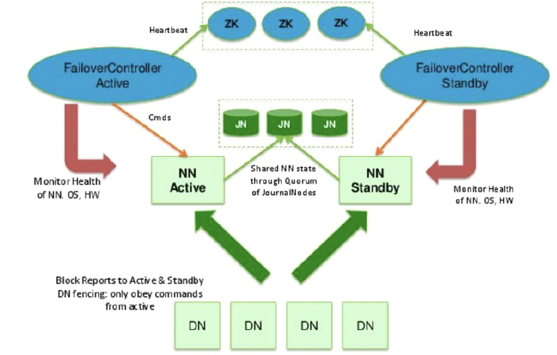

# High Availability

## Why HA?

The basic Master/Slave architecture has 2 major defects:

1. Single point failures
2. Memory is limited to contain all the meta data for large clusters

## Resolution

1. HA - Multiple NNs (at most 2 for version 2.x)
2. Federation - Sharding of the meta data, multiple NNs to manage different metadata

We will focus on HA in this page.

## Architecture of HDFS HA

More roles are introduced: `Standby NN`, to be the next active NN once the current active one is down; `Journal Nodes`, holds the logs of the writings into the HDFS; `Zookeeper cluster`, elects the master for the Hadoop cluster; and `ZKFC` (ZookeeperFailoverController), a process runs at the same node with the active and standby NN to monitor the health of the NN, keeps a connection with ZK cluster.

Journal node cluster is introduced due to the compromise between the `consistency` and `availability`. As long as half (n/2+1) of the nodes ack that the edit log is successfully stored, the journal node cluster will send a successful ack back to the active NN.

This architecture enables the entire hadoop cluster to have a new active NN in a short time once the active NN is down for some reason. Here are what will happen when the active NN is suddenly offline:

1. ZKFC on the active NN releases the ephemeral node on the ZK cluster
2. ZKFC on the standby NN watches the changes and creates a new ephemeral node on ZK
3. ZKFC on the standby NN tries to verify if the active NN is really dead, if so, downgrade it to standby and upgrade the current node to active NN.
4. Engineers are noticed to repair/restart the previous active NN.
5. The previous active NN will not become active as long as the current active one is down and its ephemeral node is deleted from ZK

Reference:  
https://hadoop.apache.org/docs/r2.6.5/hadoop-project-dist/hadoop-hdfs/HDFSHighAvailabilityWithQJM.html  
https://hadoop.apache.org/docs/r2.6.5/hadoop-project-dist/hadoop-common/ClusterSetup.html  
https://hadoop.apache.org/docs/r2.6.5/hadoop-project-dist/hadoop-common/core-default.xml  
https://hadoop.apache.org/docs/r2.6.5/hadoop-project-dist/hadoop-hdfs/hdfs-default.xml  
https://hadoop.apache.org/docs/r2.6.5/hadoop-yarn/hadoop-yarn-common/yarn-default.xml