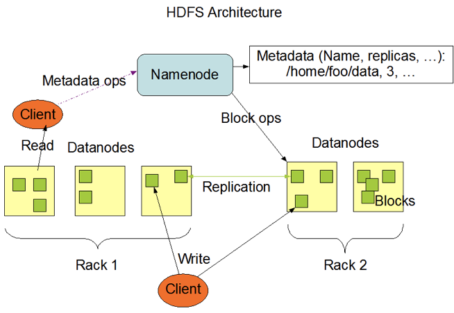
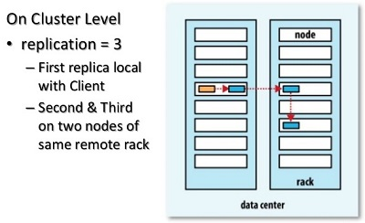

# Overview

## Roles and Architecture

1. NameNode （NN） - Stores the metadata: file name, path, replicas etc in its **memory**
2. DataNode （DN）- Stores Data blocks and send the heartbeat and block info to namenode
3. Client - Connects to namenode, transfer the the metadata of a file and get the target datanode to read files from or upload files to. Connects to datanodes and actually upload/download the files.

HDFS's Master/Slave architect

## Replicas

HDFS stores file in blocks(128M by default), and each block has several replicas located in different datanodes.

Replica placement policy:

When a new block is created, HDFS places the first replica on the node where the writer is located. The second and the third replicas are placed on two different nodes in a different rack. The rest are placed on random nodes with restrictions that no more than one replica is placed at any one node and no more than two replicas are placed in the same rack, if possible.

## MetaData Persistence

Name Node `FsImage` as a snapshot for the metadata at a certain time point, and `EditLog` to record the incremental edits on top of the `FsImage` . If there is a secondary name node in the cluster, it pulls the `FsImage` and `EditLog` from the name node and merge the edits to the `FsImage` file and create a new one and then pushes it back to the name node. This task can be scheduled and happen periodically (every 3600s or the log file is larger than 64M by default) to guarantee the metadata is always available and save the CPU and memory of the name node.

## File Uploading

1. Clients connects to the NN and creates the metadata of the file
2. NN validates the metadata (File in the same path may already exist, or user has no permission to write into HDFS)
3. Replica placement policy is triggered, NN returns a list of DN to the client
4. Client establish a pipeline to the selected (usually the closest) DN (TCP connection)
5. Client truncates the block into packets (64KB each)
6. Client fills the packets with chunk (512B) + checksum (4B)
7. Client puts the packet into a data queue and send it to the selected DN
8. The selected DN saves the packet and sends it to the next DN, which will also send the packet to the third one etc (depends on the number of replicas)
9. Meanwhile, the client sends the following packets to the selected DN without knowing that all DNs have saved the packet successfully.
10. Once the transition of a block is completed, each of the DN will ack to the NN, and at the same time, client uploads the next block

## File Downloading

To lower the latency, HDFS will let the client read the file from the closest DN to it.

1. Client connects to the NN and gets the metadata about the `fileblockLocation`
2. NN will sort the location list by distance to the client
3. Client tries to download and validates the file by the checksums

`**Downloading` a file means the client can get all blocks of the file, so it can definitely get a subset of them, in other words, read the file from a specified offset (seek) with some length. This capability actually supports the computation layer to process the data in parallel.**

Reference:  
https://hadoop.apache.org/docs/r2.6.5/hadoop-project-dist/hadoop-hdfs/HdfsDesign.html  
https://hadoop.apache.org/docs/r2.6.5/hadoop-project-dist/hadoop-common/ClusterSetup.html